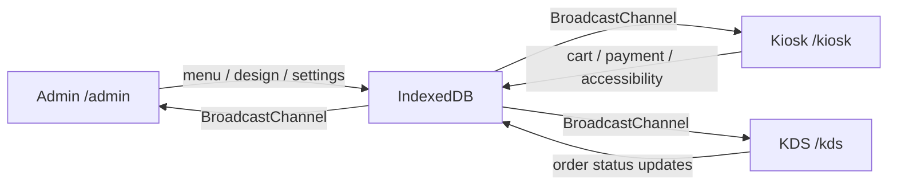

# 22B Kiosk English Guide

22B Kiosk is a local-first self-service kiosk builder for small businesses. It is designed so you can run the admin surface, the customer-facing kiosk, and the kitchen display inside one project and validate the full flow quickly.



## What This Project Does

This repository focuses on one practical idea: small stores should be able to validate a kiosk workflow without setting up a complex backend first.  
The current MVP stabilizes the core surfaces and user journeys on one origin, then leaves room for real payment and external integrations to be added later.

## Who This Is For

| Audience | Why it is useful |
|---|---|
| Cafe, bakery, and restaurant owners | Quickly test menu, design, and ordering flows |
| Agencies and freelancers | Demo admin, kiosk, and kitchen display in one project |
| Product teams | Validate accessibility, language switching, OCR, CSV import, and design customization |
| Frontend developers | Study a local-first multi-surface architecture built with Next.js App Router |

## What Works Right Now

| Area | Route | Included in this repository |
|---|---|---|
| Home | `/` | Surface launcher |
| Admin Dashboard | `/admin` | Design studio, accessibility and language settings, developer mode |
| Admin Menu | `/admin/menu` | Manual menu entry, OCR photo import, CSV import |
| Onboarding | `/admin/onboarding` | Business info, templates, payment settings, launch checks |
| Kiosk | `/kiosk` | Template rendering, cart, language switcher, accessibility modes, demo payment, Toss redirect |
| Payment Result | `/kiosk/payment/result` | Redirect payment result handling |
| KDS | `/kds` | Live order queue and status updates |

## Core Features

### 1. Admin Design Studio

- Choose a kiosk template
- Adjust brand colors
- Update greeting, logo, and background image
- Preview the actual kiosk renderer live inside the admin screen

### 2. Three Menu Input Paths

| Method | What it does |
|---|---|
| Manual entry | Add name, price, category, and description directly |
| OCR photo import | Extract menu items from an uploaded image or public image URL |
| CSV import | Bulk import using `category,name,price,description,nameEn,nameZh,nameJa` |

### 3. Accessibility Options

- Large text mode
- High contrast mode
- Simple mode
- Browser TTS voice guidance

### 4. Multi-language Support

The kiosk currently supports `ko / en / zh / ja`.  
Admins can choose which languages are enabled, and the kiosk only shows those in the language switcher.

### 5. Developer Mode

This is the Lv.2 advanced area kept separate from the regular operator flow.

- Save a Figma URL
- Save a webhook URL
- Save a CSS override and apply it to the kiosk

It is intended as a future-facing extension point for more advanced integrations.

## Quick Start

### 1. Install dependencies

```bash
npm install
```

### 2. Start the dev server

```bash
npm run dev
```

### 3. Open these routes

```text
http://localhost:3000/
http://localhost:3000/admin
http://localhost:3000/admin/menu
http://localhost:3000/admin/onboarding
http://localhost:3000/kiosk
http://localhost:3000/kds
```

## Recommended First-Time Walkthrough

1. Open `/admin/onboarding` and review the business profile, template, and payment settings.
2. Open `/admin/menu` and add items manually or import them with OCR or CSV.
3. Open `/admin` and adjust colors, greeting, logo, languages, and accessibility settings.
4. Open `/kiosk` and test the customer experience.
5. Open `/kds` and confirm that orders and status changes appear correctly.

## How OCR and CSV Work

### OCR Photo Import

- Paste a public image URL into `Image URL`, or
- Upload a menu photo directly, then
- Click `Run photo import`.

Notes:

- If no OpenAI key is available, the app falls back to a demo OCR payload.
- Anthropic and Google options are currently UI placeholders and still fall back to the demo response.

### CSV Import

Example:

```csv
category,name,price,description,nameEn,nameZh,nameJa
coffee,아메리카노,4500,진한 기본 커피,Americano,美式咖啡,アメリカーノ
dessert,소금빵,3800,짭짤한 버터 브레드,Salt Bread,盐面包,ソルトブレッド
```

Notes:

- `category` should use category ids such as `coffee`, `tea`, or `dessert`.
- `nameEn`, `nameZh`, and `nameJa` are optional.
- Paste the CSV or upload a file, preview it with `Parse CSV`, then commit it with `Import CSV items`.

## Payment Notes

| Mode | Current behavior |
|---|---|
| Demo payment | Creates a local paid order when live keys are missing |
| Toss redirect | Opens Toss checkout if a `clientKey` is configured |
| Authorization API / webhook | Not implemented yet |

## Accessibility and Language Settings

| Setting | Kiosk effect |
|---|---|
| Large text | Enlarges major copy and price labels |
| High contrast | Applies a stronger contrast palette |
| Voice guide | Speaks key kiosk actions through browser TTS |
| Simple mode | Reduces density and increases touch-friendly spacing |
| Languages | Controls which languages appear in the kiosk switcher |

## Tech Stack

| Item | Stack |
|---|---|
| Framework | Next.js 16 App Router |
| UI | React 19, Tailwind CSS |
| Local data | IndexedDB via Dexie |
| Cross-surface sync | BroadcastChannel |
| Testing | Vitest, Testing Library |
| Payments | Toss redirect path + demo mode |
| OCR | OpenAI Responses API structure + demo fallback |

## Useful Paths in the Repository

| Path | Purpose |
|---|---|
| `src/app/admin` | Admin routes |
| `src/app/kiosk` | Customer-facing kiosk routes |
| `src/app/kds` | Kitchen display routes |
| `src/components/admin` | Admin feature components |
| `src/components/kiosk` | Kiosk feature components |
| `src/lib/store` | Local store and repository logic |
| `src/lib/ocr` | OCR extraction and normalization |
| `src/lib/csv` | CSV menu parsing |
| `src/templates` | Template renderer components |

## Verification

### Automated

```bash
npm run test -- --run
npm run build
```

### Manual

- Change design and accessibility settings in `/admin`
- Add items and test OCR or CSV in `/admin/menu`
- Test language switching, cart flow, and payment flow in `/kiosk`
- Change order status in `/kds`

## Current Limitations

| Item | Status |
|---|---|
| Real payment authorization API | Not implemented yet |
| Toss webhook | Not implemented yet |
| OCR providers other than OpenAI | UI only, not fully wired |
| Real Figma import | Developer-mode storage only |
| Dedicated backend | Not included in this local MVP |

## Suggested Next Priorities

1. Toss authorization API and webhook integration
2. Fully wired multi-provider OCR
3. Real Figma import integration
4. Backend persistence and production order storage

## Language Switch

- [Back to main README](./README.md)
- [한국어 가이드 보기](./README.ko.md)
