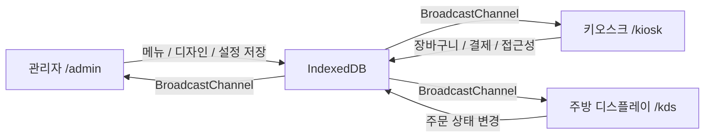

# 22B Kiosk 한국어 가이드

작은 매장에서 바로 써볼 수 있는 로컬 우선 셀프오더 키오스크 빌더입니다. 한 프로젝트 안에서 관리자, 고객용 키오스크, 주방 디스플레이 화면을 함께 실행하고 검증할 수 있도록 만들었습니다.



## 이 프로젝트가 하는 일

이 저장소는 “작은 매장도 복잡한 서버 없이 셀프오더 흐름을 빠르게 검증할 수 있게 하자”에 초점을 둔 MVP입니다.  
즉, 실제 매장에서 필요한 화면과 주요 흐름을 한 origin 안에서 먼저 안정적으로 맞추고, 이후 실결제나 외부 연동을 단계적으로 붙일 수 있게 구성했습니다.

## 누가 보면 좋은가

| 대상 | 왜 도움이 되는가 |
|---|---|
| 카페/베이커리/소형 식당 운영자 | 메뉴, 디자인, 주문 흐름을 직접 만져보며 빠르게 검증 가능 |
| 외주 개발자/에이전시 | 관리자/키오스크/KDS 동작을 한 번에 보여주는 데모용으로 적합 |
| 제품 기획자 | 접근성, 다국어, 디자인 커스터마이징, OCR/CSV 입력 흐름을 시나리오 단위로 확인 가능 |
| 프론트엔드 개발자 | Next.js App Router 기반 로컬 우선 멀티 서피스 구조를 참고 가능 |

## 지금 바로 되는 것

| 영역 | 경로 | 현재 포함된 기능 |
|---|---|---|
| 홈 | `/` | 관리자, 키오스크, KDS 이동 런처 |
| 관리자 대시보드 | `/admin` | 디자인 스튜디오, 접근성/언어 설정, 개발자 모드 |
| 관리자 메뉴 | `/admin/menu` | 메뉴 수동 등록, 사진 OCR 가져오기, CSV 가져오기 |
| 온보딩 | `/admin/onboarding` | 사업 정보, 템플릿, 결제 설정, 런치 체크 |
| 키오스크 | `/kiosk` | 템플릿 렌더링, 장바구니, 다국어, 접근성, 데모 결제, Toss 리다이렉트 |
| 결제 결과 | `/kiosk/payment/result` | 리다이렉트 결제 결과 처리 |
| KDS | `/kds` | 실시간 주문 목록, 조리 상태 변경 |

## 핵심 기능 설명

### 1. 관리자 디자인 스튜디오

- 템플릿을 고르고
- 주요 브랜드 색상을 바꾸고
- 인사말, 로고, 배경 이미지를 바꾸고
- 같은 렌더러로 키오스크 프리뷰를 바로 확인할 수 있습니다.

### 2. 메뉴 입력 방식 3종

| 방식 | 설명 |
|---|---|
| 수동 입력 | 이름, 가격, 카테고리, 설명을 직접 등록 |
| 사진 OCR | 메뉴판 이미지 URL 또는 업로드 이미지 기준으로 메뉴 추출 |
| CSV 가져오기 | `category,name,price,description,nameEn,nameZh,nameJa` 형식 지원 |

### 3. 키오스크 접근성

- 큰 글씨 모드
- 고대비 모드
- 단순 모드
- 브라우저 TTS 기반 음성 안내

### 4. 다국어

현재 `ko / en / zh / ja` 언어 전환을 지원합니다.  
관리자에서 노출 언어를 조정하면 키오스크 상단에서 해당 언어만 선택할 수 있습니다.

### 5. 개발자 모드

일반 사용자 흐름과 분리된 Lv.2 영역입니다.

- Figma URL 저장
- Webhook URL 저장
- CSS override 저장 및 키오스크 반영

이 영역은 실서비스용 고급 확장 포인트를 미리 준비한 것입니다.

## 빠른 시작

### 1. 설치

```bash
npm install
```

### 2. 개발 서버 실행

```bash
npm run dev
```

### 3. 브라우저에서 열기

```text
http://localhost:3000/
http://localhost:3000/admin
http://localhost:3000/admin/menu
http://localhost:3000/admin/onboarding
http://localhost:3000/kiosk
http://localhost:3000/kds
```

## 처음 써보는 사람용 추천 순서

1. `/admin/onboarding` 에서 매장명, 템플릿, 결제 설정을 확인합니다.
2. `/admin/menu` 에서 메뉴를 직접 넣거나 OCR/CSV로 가져옵니다.
3. `/admin` 에서 색상, 인사말, 로고, 언어, 접근성 옵션을 조정합니다.
4. `/kiosk` 에서 실제 고객 화면을 테스트합니다.
5. `/kds` 에서 주문이 들어오고 상태가 바뀌는지 확인합니다.

## OCR과 CSV는 어떻게 쓰나

### 사진 OCR

- `Image URL`에 공개 이미지 URL을 넣거나
- 사진 파일을 직접 업로드한 뒤
- `Run photo import`를 누르면 됩니다.

추가 설명:

- OpenAI 키가 없으면 데모 OCR 결과로 폴백합니다.
- OpenAI 외 provider 선택지는 현재 UI 준비 단계이며, 실제 추출은 데모 폴백으로 처리됩니다.

### CSV 가져오기

예시:

```csv
category,name,price,description,nameEn,nameZh,nameJa
coffee,아메리카노,4500,진한 기본 커피,Americano,美式咖啡,アメリカーノ
dessert,소금빵,3800,짭짤한 버터 브레드,Salt Bread,盐面包,ソルトブレッド
```

설명:

- `category`는 `coffee`, `tea`, `dessert` 같은 카테고리 id 기준입니다.
- `nameEn`, `nameZh`, `nameJa`는 선택 사항입니다.
- CSV를 붙여넣거나 파일 업로드 후 `Parse CSV`로 미리 보고, `Import CSV items`로 반영하면 됩니다.

## 결제 관련 안내

| 모드 | 동작 |
|---|---|
| 데모 결제 | 키가 없으면 로컬 데모 결제로 주문 생성 |
| Toss 리다이렉트 | `clientKey`가 있으면 Toss 결제창으로 이동 |
| 승인 API/웹훅 | 아직 미구현, 이후 실서비스 확장 영역 |

## 접근성/다국어 설정 안내

| 설정 | 키오스크 반영 내용 |
|---|---|
| Large text | 주요 텍스트와 금액 표시 확대 |
| High contrast | 더 강한 대비 팔레트 적용 |
| Voice guide | 주요 동작 시 브라우저 음성 안내 |
| Simple mode | 설명 밀도 축소, 더 큰 터치 영역 |
| Languages | 키오스크 상단 언어 선택기 노출 언어 제어 |

## 기술 스택

| 항목 | 내용 |
|---|---|
| 프레임워크 | Next.js 16 App Router |
| UI | React 19, Tailwind CSS |
| 로컬 데이터 | IndexedDB via Dexie |
| 같은 화면 동기화 | BroadcastChannel |
| 테스트 | Vitest, Testing Library |
| 결제 연결 | Toss redirect path + demo mode |
| OCR | OpenAI Responses API 구조 + demo fallback |

## 폴더를 볼 때 먼저 보면 좋은 위치

| 경로 | 역할 |
|---|---|
| `src/app/admin` | 관리자 화면 |
| `src/app/kiosk` | 고객용 키오스크 화면 |
| `src/app/kds` | 주방 디스플레이 |
| `src/components/admin` | 관리자 기능 컴포넌트 |
| `src/components/kiosk` | 키오스크 기능 컴포넌트 |
| `src/lib/store` | 로컬 스토어와 저장소 로직 |
| `src/lib/ocr` | OCR 추출/정규화 |
| `src/lib/csv` | CSV 메뉴 파싱 |
| `src/templates` | 템플릿별 렌더링 컴포넌트 |

## 검증 방법

### 자동 검증

```bash
npm run test -- --run
npm run build
```

### 수동 검증

- `/admin`에서 디자인과 접근성 설정 변경
- `/admin/menu`에서 메뉴 추가, OCR, CSV 테스트
- `/kiosk`에서 언어 전환, 장바구니, 결제 흐름 테스트
- `/kds`에서 주문 상태 변경 확인

## 현재 제한사항

| 항목 | 현재 상태 |
|---|---|
| 실결제 승인 API | 아직 없음 |
| Toss 웹훅 | 아직 없음 |
| OpenAI 외 OCR provider | UI만 있고 실제 연동은 아직 없음 |
| Figma import 실연결 | 개발자 모드 저장까지만 구현 |
| 백엔드 서버 | 로컬 MVP 기준으로 없음 |

## 다음 확장 우선순위

1. Toss 승인 API + 웹훅 실서비스 연동
2. OCR provider 다중 실연동
3. Figma import 실제 연결
4. 서버 백엔드 및 주문 영속화 확장

## 언어 전환

- [메인 README로 돌아가기](./README.md)
- [English Guide 보기](./README.en.md)
