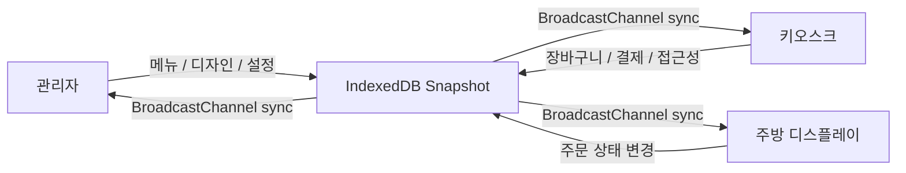

# 22B Kiosk

작은 매장을 위한 로컬 우선 셀프오더 키오스크 빌더입니다.  
관리자, 키오스크, 주방 디스플레이를 한 프로젝트 안에서 바로 실행하고 검증할 수 있습니다.



## 먼저 읽기

GitHub 첫 화면에서는 한국어 설명이 먼저 보이도록 구성했습니다.  
영문 설명이 필요하면 아래 링크에서 별도로 선택해서 볼 수 있습니다.

- [한국어 상세 가이드](./README.ko.md)
- [English Guide](./README.en.md)

## 빠른 시작

처음 실행할 때는 아래 명령만 따라오면 됩니다.

```bash
npm install
npm run dev
```

브라우저에서 열 경로:

```text
http://localhost:3000/
http://localhost:3000/admin
http://localhost:3000/admin/menu
http://localhost:3000/kiosk
http://localhost:3000/kds
```

## 지금 바로 해볼 수 있는 것

| 화면 | 경로 | 현재 포함된 기능 |
|---|---|---|
| 홈 | `/` | 관리자, 키오스크, KDS 이동 런처 |
| 관리자 | `/admin` | 디자인 스튜디오, 접근성/언어 설정, 개발자 모드 |
| 관리자 메뉴 | `/admin/menu` | 메뉴 수동 입력, 사진 OCR, CSV 가져오기 |
| 키오스크 | `/kiosk` | 템플릿 렌더링, 다국어 전환, 장바구니, 데모 결제, Toss 리다이렉트 |
| KDS | `/kds` | 실시간 주문 큐와 상태 변경 |

## 검증 명령

```bash
npm run test -- --run
npm run build
```

## 상세 문서

더 자세한 설치 방법, 사용 흐름, 기능 설명, 제한사항은 아래 문서에서 볼 수 있습니다.

- [README.ko.md](./README.ko.md)
- [README.en.md](./README.en.md)

<details>
<summary>English Summary</summary>

22B Kiosk is a local-first self-service kiosk builder for small businesses.  
It lets you run the admin, kiosk, and kitchen display flows inside one project.

- [English Guide](./README.en.md)

</details>
