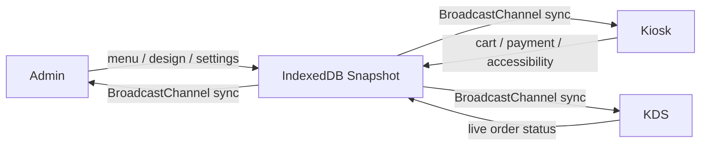

# 22B Kiosk

작은 매장을 위한 로컬 우선 셀프오더 키오스크 빌더입니다. 관리자, 키오스크, 주방 디스플레이를 한 프로젝트 안에서 바로 실행하고 검증할 수 있습니다.  
22B Kiosk is a local-first self-service kiosk builder for small businesses. It lets you run and validate the admin, kiosk, and kitchen display flows inside one project.



## Language

원하는 언어 문서를 선택해서 보시면 됩니다.  
Choose the guide you want to read.

- [한국어 상세 가이드](./README.ko.md)
- [English Guide](./README.en.md)

## Quick Start

처음 실행할 때는 아래 명령만 따라오면 됩니다.  
For a first local run, use the commands below.

```bash
npm install
npm run dev
```

브라우저에서 열 경로:  
Routes to open in the browser:

```text
http://localhost:3000/
http://localhost:3000/admin
http://localhost:3000/admin/menu
http://localhost:3000/kiosk
http://localhost:3000/kds
```

## What You Can Try

현재 저장소에서 바로 체험 가능한 핵심 흐름입니다.  
These are the key flows you can try right away in the current repository.

| Surface | Route | Included in this repo |
|---|---|---|
| Home | `/` | Surface launcher |
| Admin | `/admin` | 디자인 스튜디오, 접근성/언어 설정, 개발자 모드 |
| Admin Menu | `/admin/menu` | 메뉴 수동 입력, 사진 OCR 가져오기, CSV 가져오기 |
| Kiosk | `/kiosk` | 템플릿 렌더링, 다국어 전환, 장바구니, 데모 결제, Toss 리다이렉트 |
| KDS | `/kds` | 실시간 주문 큐와 상태 변경 |

## Verification

자동 검증 명령은 아래와 같습니다.  
The automated verification commands are below.

```bash
npm run test -- --run
npm run build
```

## Detailed Guides

설치, 사용 흐름, 기능 설명, 현재 제한사항까지 자세히 보려면 아래 문서를 열어주세요.  
Open the guides below for setup steps, workflows, feature explanations, and current limitations.

- [README.ko.md](./README.ko.md)
- [README.en.md](./README.en.md)
